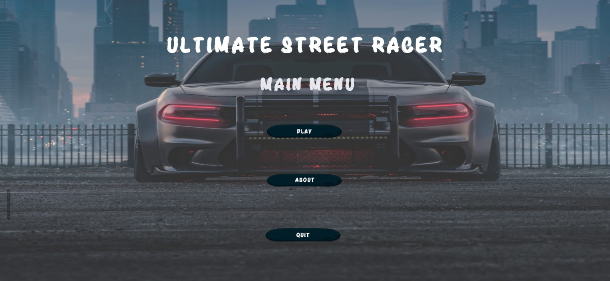
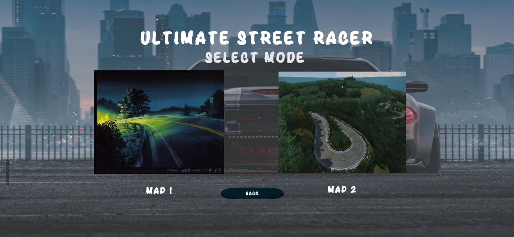
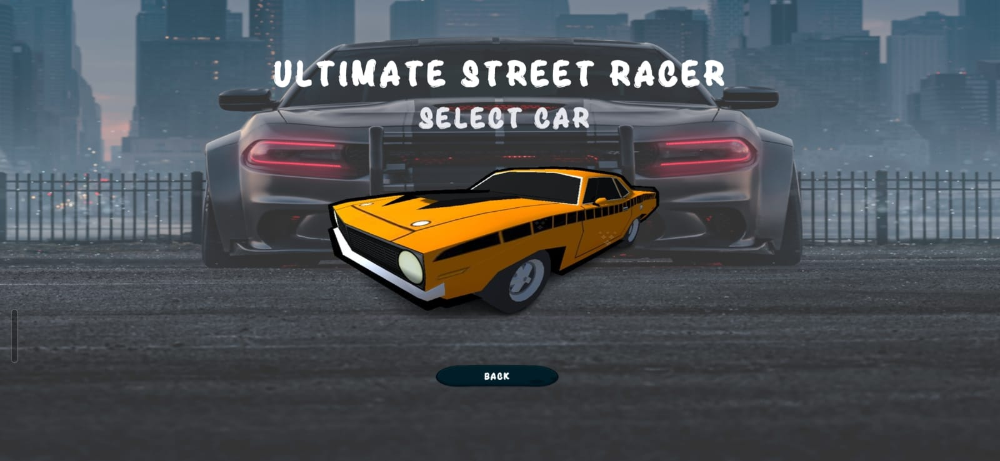
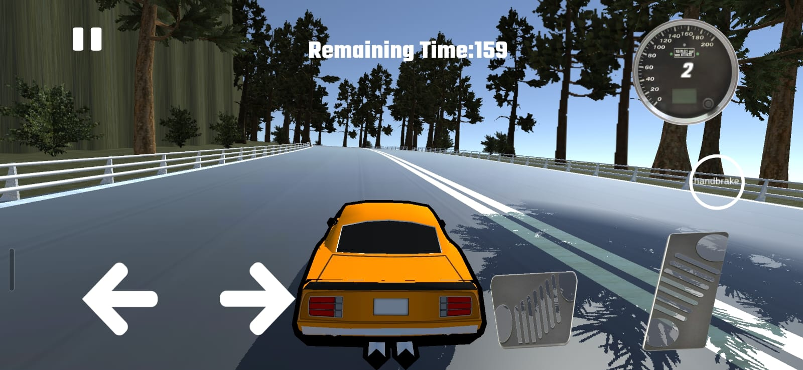

# Ultimate

> A Unity-based 3D environment and road-development project exploring terrain, road networks, and environment creation using Unity, EasyRoads3D, and RoadArchitect.

[](https://unity.com/)
[](https://learn.microsoft.com/en-us/dotnet/csharp/)
[](https://github.com/SomeshKate20/Ultimate)

---

## 🎮 Demo

**Play the project on itch.io:**

👉 [Ultimate — itch.io](https://somesh20.itch.io/ultimate)

> A playable build/demo can be added here when available.

---

## 📸 Screenshots

### Main Menu



### Select Mode



### Car Selection



### Gameplay



---

## 📖 About

**Ultimate** is a Unity project focused on 3D environment and road development.

The project combines Unity with road and terrain development tools such as **EasyRoads3D** and **RoadArchitect**. It provides a foundation for experimenting with roads, terrain, environments, assets, and potential gameplay systems.

The repository contains the Unity project, assets, packages, project configuration, and supporting development resources.

---

## ✨ Features

* 🌍 3D environment development
* 🛣️ Road creation and editing
* 🏔️ Terrain-based environment development
* 🧩 Unity assets and prefab integration
* 🛠️ EasyRoads3D integration
* 🏗️ RoadArchitect integration
* 📦 Unity Package Manager support
* 🎮 Foundation for future gameplay development

---

## 🛠️ Tech Stack

| Technology        | Purpose                                   |
| ----------------- | ----------------------------------------- |
| **Unity**         | 3D environment and project development    |
| **C#**            | Scripting and gameplay logic              |
| **EasyRoads3D**   | Road creation and environment development |
| **RoadArchitect** | Road and terrain development              |
| **Git / GitHub**  | Version control                           |

---

## 📂 Project Structure

```text
Ultimate/
│
├── Assets/
│   ├── Scenes/
│   ├── Scripts/
│   ├── Prefabs/
│   ├── Materials/
│   └── Other Unity assets
│
├── EasyRoads3Dv3/
│   └── EasyRoads3D resources
│
├── RoadArchitect/
│   └── Road and terrain resources
│
├── Packages/
│   └── Unity Package Manager dependencies
│
├── ProjectSettings/
│   └── Unity project configuration
│
├── .gitignore
├── .vsconfig
└── README.md
```

---

## 💻 Requirements

Before opening the project, install:

* **Unity Hub**
* **Unity Editor**
* **Git**
* **Visual Studio** or another C# compatible IDE

### Unity Version

Use the Unity version specified in:

```text
ProjectSettings/ProjectVersion.txt
```

Using the same Unity version helps avoid compatibility and asset-import problems.

---

## 🚀 Getting Started

### 1. Clone the Repository

```bash
git clone https://github.com/SomeshKate20/Ultimate.git
```

### 2. Open Unity Hub

Open **Unity Hub** and select:

```text
Add → Add project from disk
```

Select the cloned `Ultimate` directory.

### 3. Select the Correct Unity Version

Check:

```text
ProjectSettings/ProjectVersion.txt
```

and open the project using the corresponding Unity Editor version.

### 4. Open the Project

Allow Unity to import the project's assets and packages.

> The first import may take some time depending on your hardware and the number of project assets.

### 5. Run the Project

Open one of the available scenes from the `Assets` folder and press:

**▶ Play**

inside the Unity Editor.

---

## 🛣️ Road & Terrain Development

### EasyRoads3D

The project includes **EasyRoads3D** resources for road creation and environment development.

It can be used to create road networks and integrate roads with surrounding terrain.

### RoadArchitect

The project also contains **RoadArchitect** resources related to road and terrain development.

These tools provide additional capabilities for experimenting with road layouts and environment design.

---

## 🎯 Project Goals

The project can serve as a foundation for developing a larger interactive environment.

Potential areas of development include:

* Environment design
* Road networks
* Terrain generation
* Vehicle gameplay
* Character movement
* Exploration systems
* Lighting and visual improvements
* Performance optimization

---

## 🔮 Future Improvements

* [ ] Expand the environment
* [ ] Improve terrain detail
* [ ] Add additional road networks
* [ ] Add vehicle controls
* [ ] Add character movement
* [ ] Add gameplay mechanics
* [ ] Improve lighting and post-processing
* [ ] Optimize scene performance
* [ ] Add UI systems
* [ ] Create additional playable builds
* [ ] Add project screenshots and gameplay videos

---

## 🧹 Development Guidelines

When working on the project:

* Use the Unity version specified by the project.
* Keep scenes, scripts, prefabs, and assets organized.
* Avoid committing Unity-generated temporary files.
* Use descriptive names for GameObjects, scripts, scenes, and assets.
* Make focused and meaningful commits.
* Test changes inside Unity before pushing them.
* Check third-party asset licenses before redistribution.

---

## 🤝 Contributing

Contributions and improvements are welcome.

### Development Workflow

```bash
# Clone the repository
git clone https://github.com/SomeshKate20/Ultimate.git

# Create a feature branch
git checkout -b feature/your-feature

# Make your changes

# Stage changes
git add .

# Commit your changes
git commit -m "Add your feature"

# Push the branch
git push origin feature/your-feature
```

Then open a **Pull Request** on GitHub.

---

## 📦 Third-Party Tools & Assets

This project includes or references third-party development tools, including:

* **EasyRoads3D**
* **RoadArchitect**
* Unity packages and other third-party assets included within the project

Third-party software and assets may have their own licenses and usage restrictions.

Please review the applicable licenses before redistributing the project or its assets.

---

## 📄 License

This repository currently does not include a dedicated `LICENSE` file.

Until a license is added, the project's source code should not be assumed to be freely reusable or redistributable.

If you plan to make the project open source, consider adding an appropriate license such as MIT, Apache-2.0, or another license that matches your intended usage.

---

## 👨‍💻 Author

### Somesh Kate

GitHub:
https://github.com/SomeshKate20

---

## 🔗 Links

**GitHub Repository**

https://github.com/SomeshKate20/Ultimate

**Playable Demo**

https://somesh20.itch.io/ultimate

---

## 📌 Project Status

**🚧 In Development**

Ultimate is an ongoing Unity environment and road-development project that can be expanded with additional environments, gameplay systems, vehicles, and interactive features.

---

## ⭐ Support

If you find the project interesting, consider giving the repository a ⭐ on GitHub.
